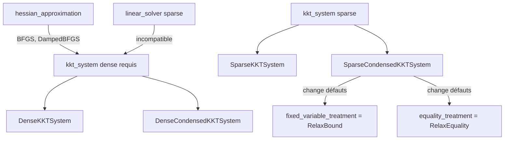

# Inventaire des types MadNLP pour les options

Ce document recense les types exacts à utiliser pour les options avancées de MadNLPSolver.

## 1. Linear Solver

**Type CTSolvers :** `Type{<:MadNLP.AbstractLinearSolver}`

### Valeurs disponibles

| Solveur | Module | Notes |
|---------|--------|-------|
| `MadNLP.UmfpackSolver` | MadNLP | CPU, sparse, inclus par défaut |
| `MadNLP.LDLSolver` | MadNLP | CPU, sparse, inclus par défaut |
| `MadNLP.CHOLMODSolver` | MadNLP | CPU, sparse, inclus par défaut |
| `MadNLP.LapackCPUSolver` | MadNLP | CPU, dense, inclus par défaut |
| `MadNLPMumps.MumpsSolver` | MadNLPMumps | CPU, sparse, défaut CTSolvers |
| `MadNLPHSL.Ma27Solver` | MadNLPHSL | CPU, sparse, extension HSL |
| `MadNLPHSL.Ma57Solver` | MadNLPHSL | CPU, sparse, extension HSL |
| `MadNLPHSL.Ma77Solver` | MadNLPHSL | CPU, sparse, extension HSL |
| `MadNLPHSL.Ma86Solver` | MadNLPHSL | CPU, sparse, extension HSL |
| `MadNLPHSL.Ma97Solver` | MadNLPHSL | CPU, sparse, extension HSL |
| `MadNLPPardiso.PardisoSolver` | MadNLPPardiso | CPU, sparse, extension Pardiso |
| `MadNLPPardiso.PardisoMKLSolver` | MadNLPPardiso | CPU, sparse, extension Pardiso |
| `MadNLPGPU.LapackGPUSolver` | MadNLPGPU | GPU, dense |
| `MadNLPGPU.RFSolver` | MadNLPGPU | GPU, sparse |
| `MadNLPGPU.GLUSolver` | MadNLPGPU | GPU, sparse |
| `MadNLPGPU.CuCholeskySolver` | MadNLPGPU | GPU, sparse |
| `MadNLPGPU.CUDSSSolver` | MadNLPGPU | GPU, sparse |

---

## 2. Log Levels

**Type CTSolvers :** `MadNLP.LogLevels`

**Définition (enum) :**

```julia
@enum(LogLevels::Int,
      TRACE  = 1,
      DEBUG  = 2,
      INFO   = 3,
      NOTICE = 4,
      WARN   = 5,
      ERROR  = 6)
```

**Valeurs :**
- `MadNLP.TRACE`
- `MadNLP.DEBUG`
- `MadNLP.INFO` (défaut)
- `MadNLP.NOTICE`
- `MadNLP.WARN`
- `MadNLP.ERROR`

---

## 3. Hessian Approximation

**Type CTSolvers :** `Type{<:MadNLP.AbstractHessian}`

**Définition :**

```julia
abstract type AbstractHessian{T, VT} end
abstract type AbstractQuasiNewton{T, VT} <: AbstractHessian{T, VT} end
```

**Valeurs disponibles :**

| Type | Description | Système KKT requis |
|------|-------------|-------------------|
| `MadNLP.ExactHessian` | Hessien exact (défaut) | Tous |
| `MadNLP.BFGS` | BFGS quasi-Newton | Dense uniquement |
| `MadNLP.DampedBFGS` | Damped BFGS | Dense uniquement |
| `MadNLP.CompactLBFGS` | L-BFGS compact | Sparse compatible |

> [!IMPORTANT]
> `BFGS` et `DampedBFGS` nécessitent un système KKT dense (`DenseKKTSystem` ou `DenseCondensedKKTSystem`).

---

## 4. Inertia Correction Method

**Type CTSolvers :** `Type{<:MadNLP.AbstractInertiaCorrector}`

**Définition :**

```julia
abstract type AbstractInertiaCorrector end
struct InertiaAuto <: AbstractInertiaCorrector end
struct InertiaBased <: AbstractInertiaCorrector end
struct InertiaIgnore <: AbstractInertiaCorrector end
struct InertiaFree{T, VT, KKTVec} <: AbstractInertiaCorrector
    # ... internal fields
end
```

**Valeurs disponibles :**

| Type | Description |
|------|-------------|
| `MadNLP.InertiaAuto` | Sélection automatique (défaut) |
| `MadNLP.InertiaBased` | Basé sur inertie (stratégie Ipopt) |
| `MadNLP.InertiaFree` | Sans inertie (Chiang 2016) |
| `MadNLP.InertiaIgnore` | Ignorer l'inertie |

---

## 5. KKT System

**Type CTSolvers :** `Type{<:MadNLP.AbstractKKTSystem}`

**Valeurs sparse :**

| Type | Description |
|------|-------------|
| `MadNLP.SparseKKTSystem` | Système augmenté sparse (défaut sparse) |
| `MadNLP.SparseCondensedKKTSystem` | Système condensé sparse |
| `MadNLP.SparseUnreducedKKTSystem` | Système non réduit sparse |
| `MadNLP.ScaledSparseKKTSystem` | Système sparse mis à l'échelle |

**Valeurs dense :**

| Type | Description |
|------|-------------|
| `MadNLP.DenseKKTSystem` | Système augmenté dense |
| `MadNLP.DenseCondensedKKTSystem` | Système condensé dense |

---

## 6. Fixed Variable Treatment

**Type CTSolvers :** `Type` (sous-type de traitement)

**Valeurs :**
- `MadNLP.MakeParameter` (défaut hors condensé)
- `MadNLP.RelaxBound` (défaut pour SparseCondensedKKTSystem)

---

## 7. Equality Treatment

**Type CTSolvers :** `Type`

**Valeurs :**
- `MadNLP.EnforceEquality` (défaut hors condensé)
- `MadNLP.RelaxEquality` (défaut pour SparseCondensedKKTSystem)

---

## 8. Iterator

**Type CTSolvers :** `Type`

**Valeurs :**
- `MadNLP.RichardsonIterator` (défaut)
- `MadNLPKrylov.KrylovIterator` (nécessite extension MadNLPKrylov)

---

## 9. Callback

**Type CTSolvers :** `Type`

**Valeurs :**
- `MadNLP.SparseCallback` (défaut pour problèmes sparse)
- `MadNLP.DenseCallback` (défaut pour problèmes denses)

---

## Compatibilités entre options



---

## Exemple d'utilisation avec types contraints

```julia
# Dans CTSolversMadNLP.jl

Strategies.OptionDefinition(;
    name=:hessian_approximation,
    type=Type{<:MadNLP.AbstractHessian},
    description="Hessian approximation method (ExactHessian, BFGS, DampedBFGS, CompactLBFGS)"
)

Strategies.OptionDefinition(;
    name=:inertia_correction_method,
    type=Type{<:MadNLP.AbstractInertiaCorrector},
    description="Inertia correction strategy (InertiaAuto, InertiaBased, InertiaFree, InertiaIgnore)"
)

Strategies.OptionDefinition(;
    name=:kkt_system,
    type=Type{<:MadNLP.AbstractKKTSystem},
    description="KKT system type (SparseKKTSystem, DenseKKTSystem, SparseCondensedKKTSystem, etc.)"
)
```
