# Diagrammes Mermaid pour la Documentation CTSolvers

**Date** : 9 février 2026
**Objet** : Catalogue de diagrammes proposés pour chaque page de documentation

Ce document recense les diagrammes Mermaid à intégrer dans la documentation.
Chaque diagramme est associé à la page où il apparaîtrait et accompagné
d'une justification.

---

## 1. `architecture.md` — Vue d'ensemble

### 1.1 Hiérarchie des types abstraits (class diagram)

Ce diagramme remplace le diagramme ASCII et montre les relations d'héritage
entre tous les types abstraits et concrets de CTSolvers.

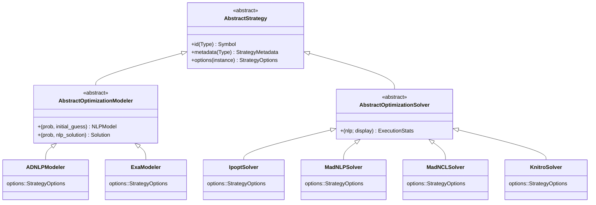

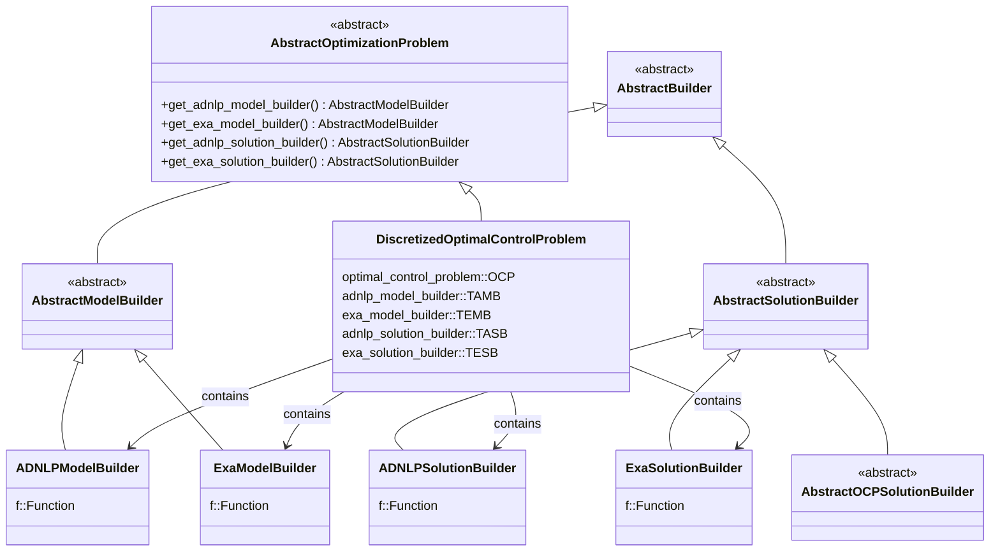

**Justification** : C'est le diagramme le plus important de toute la documentation.
Il donne la carte mentale complète du système de types. Deux diagrammes séparés
pour éviter la surcharge visuelle : un pour la branche Strategy, un pour la branche
Optimization/Builders.

---

### 1.2 Dépendances entre modules (flowchart)

Montre l'ordre de chargement réel tel que défini dans `CTSolvers.jl` (lignes 47-73)
et les dépendances `using` de chaque module.

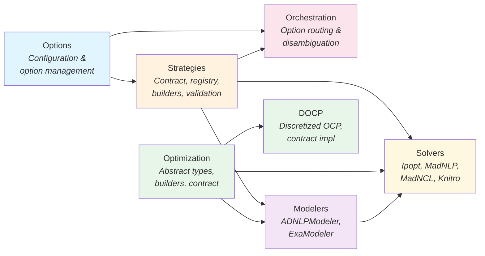

**Justification** : Montre visuellement pourquoi l'ordre d'inclusion dans
`CTSolvers.jl` est important et quelles dépendances existent entre modules.
Les couleurs regroupent les familles fonctionnelles.

---

### 1.3 Flux de résolution complet (sequence diagram)

Le chemin d'une résolution de bout en bout, montrant les interactions
entre les composants.

```mermaid
sequenceDiagram
    participant User
    participant CommonSolve as CommonSolve.solve
    participant Modeler as ADNLPModeler
    participant DOCP as DiscretizedOCP
    participant Builder as ADNLPModelBuilder
    participant Solver as IpoptSolver
    participant SolBuilder as ADNLPSolutionBuilder

    User ->> CommonSolve: solve(docp, x0, modeler, solver)

    Note over CommonSolve: Step 1: Build NLP Model
    CommonSolve ->> Modeler: build_model(docp, x0, modeler)
    Modeler ->> DOCP: get_adnlp_model_builder(docp)
    DOCP -->> Modeler: ADNLPModelBuilder
    Modeler ->> Builder: builder(x0; options...)
    Builder -->> Modeler: ADNLPModel
    Modeler -->> CommonSolve: nlp::ADNLPModel

    Note over CommonSolve: Step 2: Solve NLP
    CommonSolve ->> Solver: solve(nlp, solver)
    Solver ->> Solver: solver(nlp; display=true)
    Note right of Solver: Delegates to ext/<br/>CTSolversIpopt.jl
    Solver -->> CommonSolve: stats::ExecutionStats

    Note over CommonSolve: Step 3: Build Solution
    CommonSolve ->> Modeler: build_solution(docp, stats, modeler)
    Modeler ->> DOCP: get_adnlp_solution_builder(docp)
    DOCP -->> Modeler: ADNLPSolutionBuilder
    Modeler ->> SolBuilder: builder(stats)
    SolBuilder -->> Modeler: OptimalControlSolution
    Modeler -->> CommonSolve: solution

    CommonSolve -->> User: OptimalControlSolution
```

**Justification** : Ce diagramme de séquence est le plus utile pour un développeur.
Il montre exactement quelles méthodes sont appelées, dans quel ordre, et par qui.
Il rend concret le flux abstrait `OCP → NLP → Solution`.

---

## 2. `guides/implementing_a_strategy.md` — Two-level contract

### 2.1 Le two-level contract (flowchart)

Montre la distinction entre méthodes type-level et instance-level.

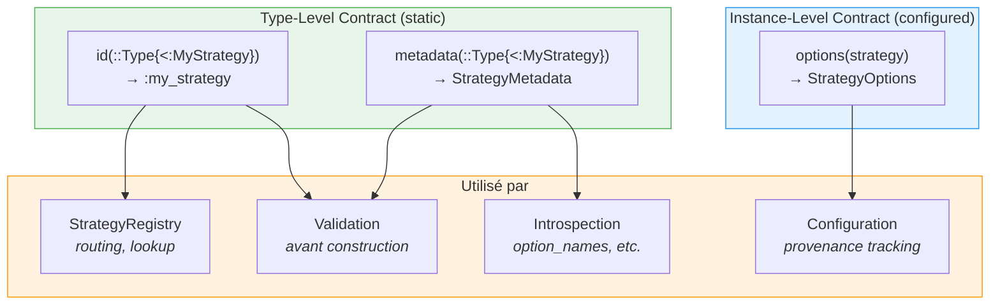

**Justification** : Le two-level contract est le concept architectural le plus
important de CTSolvers. Ce diagramme le rend immédiatement compréhensible.

---

### 2.2 Cycle de vie d'une stratégie (flowchart)

Du type à l'instance, en passant par la validation.

```mermaid
flowchart LR
    A["Définir struct\n<code>MyStrategy &lt;: AbstractStrategy</code>"] --> B
    B["Implémenter id()\n<code>id(::Type) = :my_strat</code>"] --> C
    C["Implémenter metadata()\n<code>StrategyMetadata(...)</code>"] --> D
    D["Constructeur\n<code>build_strategy_options()</code>"] --> E
    E["Validation\n<code>validate_strategy_contract()</code>"] --> F
    F["Enregistrement\n<code>StrategyRegistry</code>"] --> G
    G["Utilisation\n<code>strategy = MyStrategy(...)</code>"]

    style A fill:#ffebee
    style B fill:#fce4ec
    style C fill:#f3e5f5
    style D fill:#ede7f6
    style E fill:#e8eaf6
    style F fill:#e3f2fd
    style G fill:#e1f5fe
```

**Justification** : Donne une vue d'ensemble du parcours d'implémentation
avant de plonger dans les détails de chaque étape.

---

### 2.3 Composition des types Options (ER diagram)

Montre les relations entre `OptionDefinition`, `StrategyMetadata`,
`StrategyOptions` et `OptionValue`.

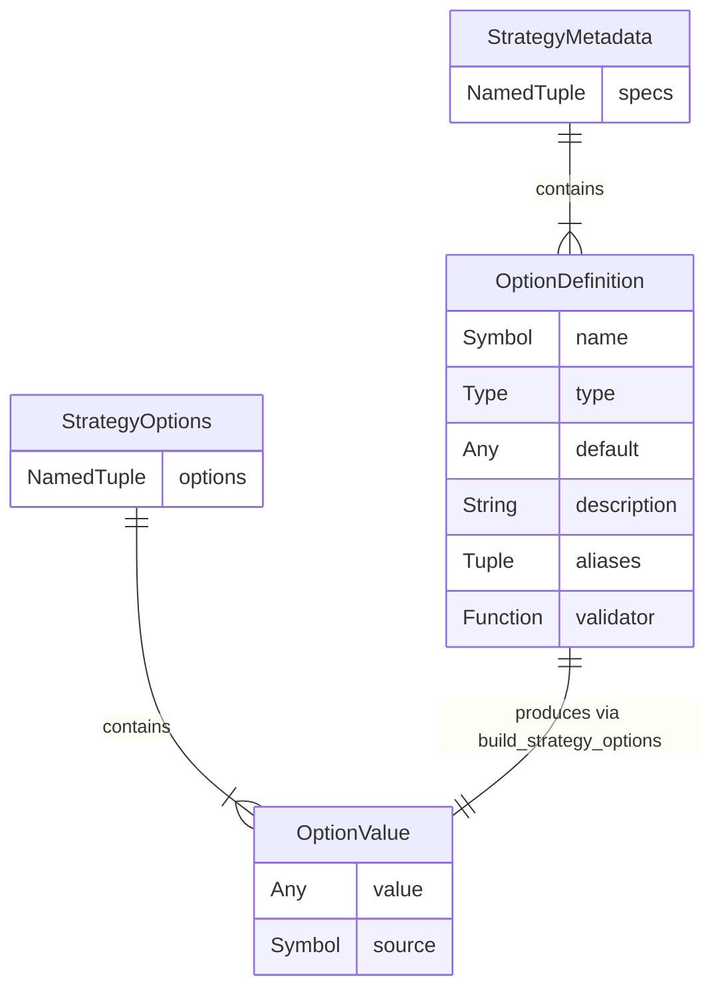

**Justification** : Clarifie comment les types Options s'emboîtent.
Un développeur qui implémente une stratégie doit comprendre cette chaîne :
`OptionDefinition` → `StrategyMetadata` → `build_strategy_options` →
`StrategyOptions` (contenant des `OptionValue`).

---

## 3. `guides/implementing_a_solver.md` — Solveurs et extensions

### 3.1 Architecture Solver + Extension (flowchart)

Montre la séparation entre `src/Solvers/` et `ext/`.

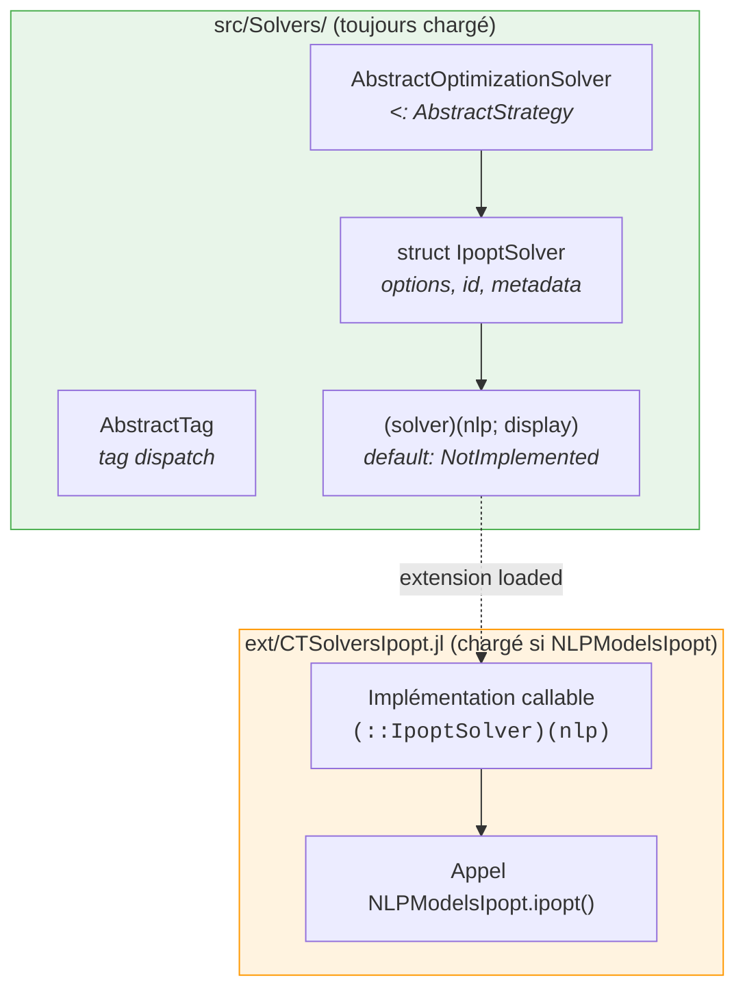

**Justification** : Le pattern Tag Dispatch et la séparation src/ext est
un concept clé pour quiconque veut ajouter un nouveau solveur. Ce diagramme
rend la mécanique visible.

---

### 3.2 CommonSolve multi-level (flowchart)

Les 3 niveaux de l'API CommonSolve.

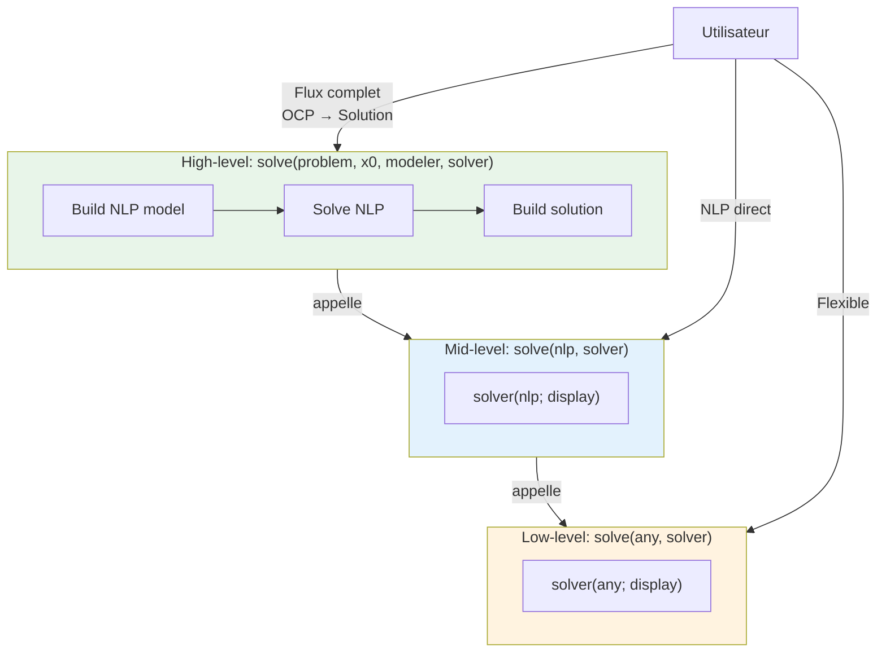

**Justification** : Montre clairement les 3 points d'entrée de l'API
et quand utiliser chacun.

---

## 4. `guides/implementing_a_modeler.md` — Modelers

### 4.1 Flux Modeler (sequence diagram)

Comment un modeler interagit avec le problème et les builders.

```mermaid
sequenceDiagram
    participant Caller
    participant Modeler as ADNLPModeler
    participant Problem as AbstractOptimizationProblem
    participant ModelBuilder as ADNLPModelBuilder
    participant SolBuilder as ADNLPSolutionBuilder

    Note over Caller,SolBuilder: Phase 1: Model Building
    Caller ->> Modeler: modeler(prob, initial_guess)
    Modeler ->> Problem: get_adnlp_model_builder(prob)
    Problem -->> Modeler: builder::ADNLPModelBuilder
    Modeler ->> Modeler: options_dict(modeler)
    Modeler ->> ModelBuilder: builder(initial_guess; options...)
    ModelBuilder -->> Caller: nlp::ADNLPModel

    Note over Caller,SolBuilder: Phase 2: Solution Building
    Caller ->> Modeler: modeler(prob, nlp_stats)
    Modeler ->> Problem: get_adnlp_solution_builder(prob)
    Problem -->> Modeler: builder::ADNLPSolutionBuilder
    Modeler ->> SolBuilder: builder(nlp_stats)
    SolBuilder -->> Caller: solution::OptimalControlSolution
```

**Justification** : Montre les deux callables du modeler et comment ils
interagissent avec le contrat `AbstractOptimizationProblem`. Essentiel
pour comprendre le rôle de chaque composant.

---

## 5. `guides/implementing_an_optimization_problem.md`

### 5.1 Contrat AbstractOptimizationProblem (ER diagram)

Montre la structure du DOCP et ses relations avec les builders.

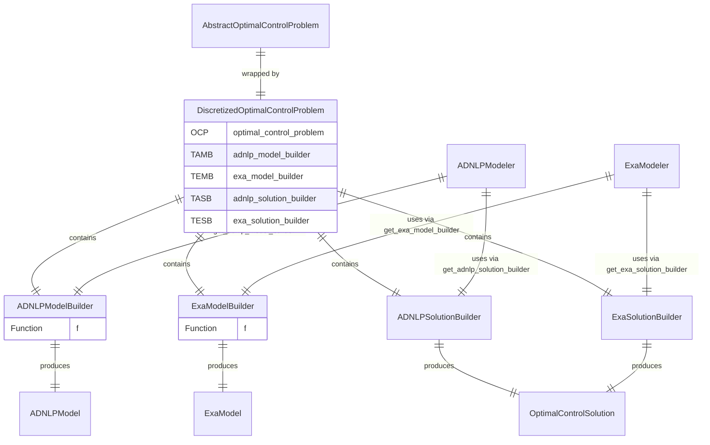

**Justification** : Montre comment le DOCP encapsule les builders et comment
les modelers les utilisent. C'est le diagramme de référence pour comprendre
le pattern Builder tel qu'implémenté dans CTSolvers.

---

## 6. `guides/orchestration_and_routing.md` — Routage d'options

### 6.1 Flux de routage (flowchart)

Le parcours d'une option depuis les kwargs utilisateur jusqu'à la stratégie cible.

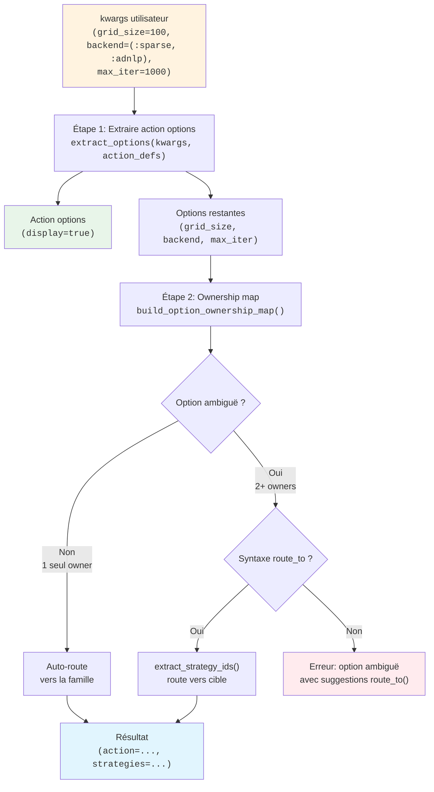

**Justification** : Le routage d'options est le mécanisme le plus complexe
de l'Orchestration. Ce flowchart montre le parcours décisionnel complet,
y compris les cas d'erreur.

---

### 6.2 Désambiguïsation (sequence diagram)

Exemple concret de routage avec 3 stratégies.

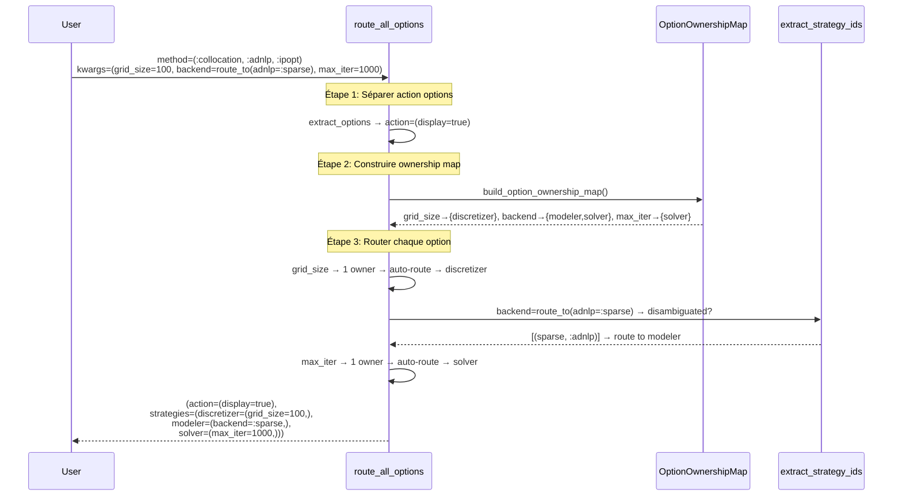

**Justification** : Montre un cas concret avec les 3 types de routage :
auto-route (unambiguous), désambiguïsation explicite, et auto-route simple.
Rend le mécanisme tangible.

---

## 7. `guides/options_system.md` — Système d'options

### 7.1 Chaîne de construction des options (flowchart)

De la définition à l'utilisation.

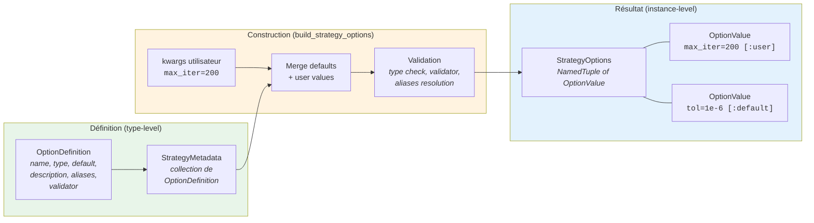

**Justification** : Montre la chaîne complète de construction des options,
depuis la définition jusqu'à l'instance avec provenance tracking. Essentiel
pour comprendre comment les options sont validées et assemblées.

---

### 7.2 Modes de validation (flowchart)

Strict vs permissif.

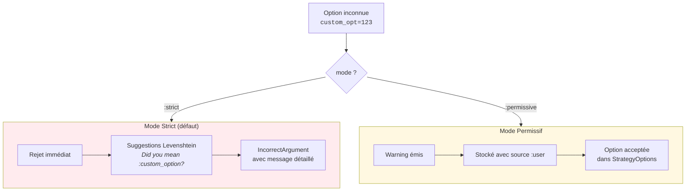

**Justification** : Les deux modes de validation sont un concept clé
que le développeur doit comprendre pour choisir le bon mode dans son
constructeur.

---

## 8. Récapitulatif : Diagrammes par page

| Page | Diagramme | Type Mermaid | Section |
| ---- | --------- | ------------ | ------- |
| `architecture.md` | Hiérarchie types Strategy | classDiagram | 1.1 |
| `architecture.md` | Hiérarchie types Optimization | classDiagram | 1.1 |
| `architecture.md` | Dépendances modules | flowchart | 1.2 |
| `architecture.md` | Flux de résolution | sequenceDiagram | 1.3 |
| `implementing_a_strategy.md` | Two-level contract | flowchart | 2.1 |
| `implementing_a_strategy.md` | Cycle de vie | flowchart | 2.2 |
| `implementing_a_strategy.md` | Types Options | erDiagram | 2.3 |
| `implementing_a_solver.md` | Solver + Extension | flowchart | 3.1 |
| `implementing_a_solver.md` | CommonSolve levels | flowchart | 3.2 |
| `implementing_a_modeler.md` | Flux Modeler | sequenceDiagram | 4.1 |
| `implementing_an_optimization_problem.md` | DOCP + Builders | erDiagram | 5.1 |
| `orchestration_and_routing.md` | Flux de routage | flowchart | 6.1 |
| `orchestration_and_routing.md` | Désambiguïsation | sequenceDiagram | 6.2 |
| `options_system.md` | Chaîne de construction | flowchart | 7.1 |
| `options_system.md` | Modes de validation | flowchart | 7.2 |

**Total** : 15 diagrammes répartis sur 8 pages.

---

## 9. Notes techniques

### Compatibilité Documenter.jl + Mermaid

Documenter.jl supporte nativement les blocs Mermaid via la syntaxe :

````markdown

````

Aucune configuration supplémentaire n'est nécessaire avec les versions
récentes de Documenter.jl (v1.0+). Le rendu est fait côté client via
la bibliothèque JavaScript Mermaid.

### Conventions de style

- **Couleurs** : Utiliser des teintes pastel pour les groupes fonctionnels.
  Pas de couleurs vives qui fatiguent la lecture.
- **Direction** : `TB` (top-bottom) pour les hiérarchies, `LR` (left-right)
  pour les flux séquentiels.
- **Taille** : Limiter à 10-15 nœuds par diagramme. Au-delà, découper
  en sous-diagrammes.
- **Texte** : Garder les labels courts. Utiliser `<i>...</i>` pour les
  descriptions secondaires.
- **Subgraphs** : Utiliser pour regrouper les composants par responsabilité
  ou par phase.
