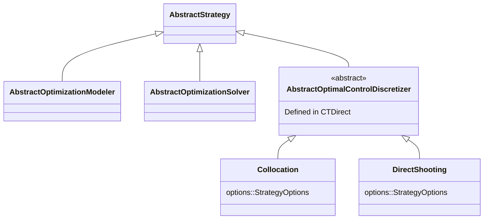

# Tutoriel Concret : Famille de Stratégies Discretizer

**Date** : 9 février 2026
**Objet** : Utiliser Collocation et DirectShooting comme exemples réalistes
dans le guide `implementing_a_strategy.md`

---

## 1. Motivation

Le guide `implementing_a_strategy.md` (section 3.4 de la structure révisée)
utilise actuellement un exemple abstrait `MyStrategy`. C'est pédagogiquement
faible : le développeur ne voit pas le lien avec un cas d'usage réel.

**Proposition** : Remplacer `MyStrategy` par un exemple concret issu de
l'écosystème control-toolbox — la famille `AbstractOptimalControlDiscretizer`
avec deux stratégies concrètes : `Collocation` et `DirectShooting`.

### Pourquoi cet exemple est idéal

1. **Réaliste** : Ce sont de vraies stratégies qui seront implémentées dans CTDirect.
2. **Famille avec 2+ membres** : Montre le pattern des types abstraits intermédiaires
   (strategy families), le registry avec plusieurs stratégies, et le routage.
3. **Options variées** : `Collocation` a des options spécifiques (grid, scheme),
   `DirectShooting` en aura d'autres — montre que chaque stratégie a ses propres
   `OptionDefinition`.
4. **Pas de détails techniques** : On n'a pas besoin d'expliquer ce qu'est la
   collocation ou le tir direct. On montre juste comment structurer les types,
   remplir le contrat, et enregistrer les stratégies.

---

## 2. Correspondance Ancien → Nouveau

Pour référence interne uniquement (ne pas inclure dans la documentation finale).

| Ancien (CTDirect/CTModels) | Nouveau (CTSolvers) |
| -------------------------- | ------------------- |
| `CTModels.AbstractOCPTool` | `Strategies.AbstractStrategy` |
| `AbstractOptimalControlDiscretizer <: AbstractOCPTool` | `AbstractOptimalControlDiscretizer <: AbstractStrategy` |
| `CTModels.get_symbol(::Type)` | `Strategies.id(::Type)` |
| `CTModels._option_specs(::Type)` → `OptionSpec` | `Strategies.metadata(::Type)` → `StrategyMetadata` avec `OptionDefinition` |
| `options_values` + `options_sources` (2 champs) | `options::StrategyOptions` (1 seul champ, provenance intégrée) |
| `CTModels._build_ocp_tool_options(T; kwargs..., strict_keys=true)` | `Strategies.build_strategy_options(T; mode=:strict, kwargs...)` |
| `REGISTERED_DISCRETIZERS` (const tuple) + lookup manuel | `StrategyRegistry` + `create_registry()` + `type_from_id()` |
| `build_discretizer_from_symbol(sym; kwargs...)` | `build_strategy(:collocation, AbstractOptimalControlDiscretizer, registry; kwargs...)` |
| `CTModels.get_option_value(discretizer, :scheme)` | `Strategies.option_value(discretizer, :scheme)` ou `discretizer.options[:scheme]` |

---

## 3. Synopsis du Tutoriel Révisé

Le guide `implementing_a_strategy.md` est restructuré pour utiliser cet exemple
concret. Voici le synopsis section par section.

### Section 1 — The Two-Level Contract

Inchangé par rapport à la structure révisée. Explication du contrat avec
diagramme Mermaid (cf. `04_mermaid_diagrams.md`, section 2.1).

### Section 2 — Defining a Strategy Family

**Nouveau contenu.** Montre comment créer un type abstrait intermédiaire
pour regrouper des stratégies apparentées.

```julia
"""
Abstract type for optimal control discretization strategies.

Concrete subtypes implement specific discretization schemes
(collocation, direct shooting, etc.) that transform a continuous-time
optimal control problem into a discrete representation.
"""
abstract type AbstractOptimalControlDiscretizer <: CTSolvers.Strategies.AbstractStrategy end
```

Explication : ce type intermédiaire permet de :
- Regrouper les discrétiseurs dans un registry par famille
- Dispatcher sur la famille dans le routage d'options
- Ajouter des méthodes communes à tous les discrétiseurs

### Section 3 — Implementing a Concrete Strategy: Collocation

Pas à pas complet.

#### Step 1: Define the struct

```julia
struct Collocation <: AbstractOptimalControlDiscretizer
    options::CTSolvers.Strategies.StrategyOptions
end
```

Un seul champ `options` — plus besoin de `options_values` et `options_sources`
séparés. La provenance est intégrée dans `StrategyOptions`.

#### Step 2: Implement `id`

```julia
CTSolvers.Strategies.id(::Type{<:Collocation}) = :collocation
```

#### Step 3: Define default values

```julia
__collocation_grid_size()::Int = 250
__collocation_scheme()::Symbol = :midpoint
```

#### Step 4: Implement `metadata`

```julia
function CTSolvers.Strategies.metadata(::Type{<:Collocation})
    return CTSolvers.Strategies.StrategyMetadata(
        CTSolvers.Options.OptionDefinition(
            name = :grid_size,
            type = Int,
            default = __collocation_grid_size(),
            description = "Number of time steps for the collocation grid",
        ),
        CTSolvers.Options.OptionDefinition(
            name = :scheme,
            type = Symbol,
            default = __collocation_scheme(),
            description = "Time integration scheme (e.g., :midpoint, :trapeze)",
        ),
    )
end
```

Ici, montrer l'affichage de `metadata` via un bloc `@repl` :

```julia
julia> CTSolvers.Strategies.metadata(Collocation)
```

#### Step 5: Implement the constructor

```julia
function Collocation(; mode::Symbol = :strict, kwargs...)
    opts = CTSolvers.Strategies.build_strategy_options(Collocation; mode = mode, kwargs...)
    return Collocation(opts)
end
```

Montrer la construction avec et sans options :

```julia
julia> Collocation()
julia> Collocation(grid_size = 500, scheme = :trapeze)
```

Montrer le mode permissif :

```julia
julia> Collocation(grid_size = 500, custom_param = 42; mode = :permissive)
```

Montrer l'erreur en mode strict avec une option inconnue :

```julia
julia> Collocation(grdi_size = 500)  # typo → Levenshtein suggestion
```

#### Step 6: Verify the contract

```julia
julia> CTSolvers.Strategies.validate_strategy_contract(Collocation)
```

#### Step 7: Access options

```julia
julia> c = Collocation(grid_size = 100)
julia> CTSolvers.Strategies.options(c)
julia> CTSolvers.Strategies.option_value(c, :grid_size)
julia> CTSolvers.Strategies.option_source(c, :grid_size)
julia> CTSolvers.Strategies.is_user(c, :grid_size)
julia> CTSolvers.Strategies.is_default(c, :scheme)
```

### Section 4 — Adding a Second Strategy: DirectShooting

Montre que le pattern est identique pour une deuxième stratégie de la même
famille, avec des options différentes.

```julia
struct DirectShooting <: AbstractOptimalControlDiscretizer
    options::CTSolvers.Strategies.StrategyOptions
end

CTSolvers.Strategies.id(::Type{<:DirectShooting}) = :direct_shooting

__shooting_grid_size()::Int = 100

function CTSolvers.Strategies.metadata(::Type{<:DirectShooting})
    return CTSolvers.Strategies.StrategyMetadata(
        CTSolvers.Options.OptionDefinition(
            name = :grid_size,
            type = Int,
            default = __shooting_grid_size(),
            description = "Number of shooting intervals",
        ),
    )
end

function DirectShooting(; mode::Symbol = :strict, kwargs...)
    opts = CTSolvers.Strategies.build_strategy_options(
        DirectShooting; mode = mode, kwargs...
    )
    return DirectShooting(opts)
end
```

**Point pédagogique** : `grid_size` existe dans les deux stratégies mais avec
des defaults et descriptions différents. Cela illustre que chaque stratégie
a ses propres `OptionDefinition` indépendantes.

### Section 5 — Registering the Family

```julia
registry = CTSolvers.Strategies.create_registry(
    AbstractOptimalControlDiscretizer => (Collocation, DirectShooting),
)
```

Montrer les opérations sur le registry :

```julia
julia> CTSolvers.Strategies.strategy_ids(AbstractOptimalControlDiscretizer, registry)
# (:collocation, :direct_shooting)

julia> CTSolvers.Strategies.type_from_id(:collocation, AbstractOptimalControlDiscretizer, registry)
# Collocation

julia> CTSolvers.Strategies.build_strategy(
    :collocation, AbstractOptimalControlDiscretizer, registry;
    grid_size = 300
)
# Collocation(...)
```

### Section 6 — Integration with Method Tuples

Montre comment le discrétiseur s'intègre dans un method tuple avec
un modeler et un solver :

```julia
method = (:collocation, :adnlp, :ipopt)

# Extract the discretizer ID from the method tuple
disc_id = CTSolvers.Strategies.extract_id_from_method(
    method, AbstractOptimalControlDiscretizer, registry
)
# :collocation

# Build the discretizer from the method tuple
discretizer = CTSolvers.Strategies.build_strategy_from_method(
    method, AbstractOptimalControlDiscretizer, registry;
    grid_size = 500, scheme = :trapeze
)
# Collocation(...)
```

### Section 7 — Introspection

```julia
julia> CTSolvers.Strategies.option_names(Collocation)
# (:grid_size, :scheme)

julia> CTSolvers.Strategies.option_names(DirectShooting)
# (:grid_size,)

julia> CTSolvers.Strategies.option_defaults(Collocation)
# (grid_size = 250, scheme = :midpoint)

julia> CTSolvers.Strategies.option_defaults(DirectShooting)
# (grid_size = 100,)
```

---

## 4. Impact sur la Structure Révisée

### 4.1 Modifications dans `02_revised_structure.md`

**Section 3.2 `architecture.md`** — Mettre à jour la hiérarchie des types :

```text
AbstractStrategy
├── AbstractOptimizationModeler
│   ├── ADNLPModeler
│   └── ExaModeler
├── AbstractOptimizationSolver
│   ├── IpoptSolver
│   ├── MadNLPSolver
│   ├── MadNCLSolver
│   └── KnitroSolver
└── AbstractOptimalControlDiscretizer    ← NOUVEAU (dans CTDirect)
    ├── Collocation
    └── DirectShooting
```

Note : `AbstractOptimalControlDiscretizer` et ses sous-types sont définis
dans CTDirect, pas dans CTSolvers. Mais le contrat `AbstractStrategy` et
toute l'infrastructure (registry, options, routing) viennent de CTSolvers.
La documentation CTSolvers montre comment utiliser cette infrastructure ;
CTDirect est le cas d'usage concret.

**Section 3.4 `implementing_a_strategy.md`** — Remplacer le synopsis :

L'ancien synopsis avec `MyStrategy` est remplacé par le synopsis détaillé
ci-dessus (sections 1-7). Le guide passe de ~300-400 lignes à ~400-500 lignes
pour accommoder les deux exemples concrets et les affichages `@repl`.

**Section 3.8 `orchestration_and_routing.md`** — Mettre à jour l'exemple :

Le method tuple `(:collocation, :adnlp, :ipopt)` est déjà utilisé dans
les exemples de routage. Avec le tutoriel discretizer, le lecteur comprend
maintenant d'où vient `:collocation` et comment il est résolu.

### 4.2 Modifications dans `04_mermaid_diagrams.md`

**Section 1.1** — Ajouter la branche Discretizer au class diagram :



**Section 2.2** — Mettre à jour le cycle de vie avec Collocation comme exemple
au lieu de `MyStrategy`.

### 4.3 Modifications dans `05_display_strategy.md`

Ajouter les affichages Collocation/DirectShooting dans la table de la
section 3.1 (affichages normaux) :

| Affichage | Type | Page cible |
| --------- | ---- | ---------- |
| `Collocation()` | compact show | `implementing_a_strategy.md` |
| `Collocation(grid_size=500)` | compact show | `implementing_a_strategy.md` |
| `metadata(Collocation)` | pretty show | `implementing_a_strategy.md` |
| `options(Collocation(...))` | pretty show | `implementing_a_strategy.md` |
| `DirectShooting()` | compact show | `implementing_a_strategy.md` |
| `StrategyRegistry` avec discretizers | pretty show | `implementing_a_strategy.md` |

Et dans la table 3.2 (erreurs) :

| Erreur | Déclencheur | Page cible |
| ------ | ----------- | ---------- |
| `IncorrectArgument` : typo `grdi_size` | Levenshtein suggestion | `implementing_a_strategy.md` |
| `IncorrectArgument` : unknown discretizer ID | `type_from_id(:unknown, ...)` | `implementing_a_strategy.md` |

---

## 5. Blocs Documenter.jl Proposés

Voici comment les exemples s'intègrent dans la documentation finale
en utilisant les mécanismes `@setup`/`@example`/`@repl`.

### Setup caché (imports)

````markdown
```@setup discretizer
using CTSolvers
using CTSolvers.Strategies
using CTSolvers.Options
```
````

### Définition de la famille (visible)

````markdown
```@example discretizer
abstract type AbstractOptimalControlDiscretizer <: CTSolvers.Strategies.AbstractStrategy end
nothing # hide
```
````

### Implémentation Collocation (visible, pas à pas)

````markdown
```@example discretizer
struct Collocation <: AbstractOptimalControlDiscretizer
    options::CTSolvers.Strategies.StrategyOptions
end

CTSolvers.Strategies.id(::Type{<:Collocation}) = :collocation

__collocation_grid_size()::Int = 250
__collocation_scheme()::Symbol = :midpoint

function CTSolvers.Strategies.metadata(::Type{<:Collocation})
    return CTSolvers.Strategies.StrategyMetadata(
        CTSolvers.Options.OptionDefinition(
            name = :grid_size, type = Int,
            default = __collocation_grid_size(),
            description = "Number of time steps for the collocation grid",
        ),
        CTSolvers.Options.OptionDefinition(
            name = :scheme, type = Symbol,
            default = __collocation_scheme(),
            description = "Time integration scheme",
        ),
    )
end

function Collocation(; mode::Symbol = :strict, kwargs...)
    opts = CTSolvers.Strategies.build_strategy_options(Collocation; mode = mode, kwargs...)
    return Collocation(opts)
end
nothing # hide
```
````

### Affichages (via @repl)

````markdown
Let's verify the metadata:

```@repl discretizer
CTSolvers.Strategies.metadata(Collocation)
```

Create an instance with custom options:

```@repl discretizer
c = Collocation(grid_size = 500, scheme = :trapeze)
CTSolvers.Strategies.options(c)
CTSolvers.Strategies.option_value(c, :grid_size)
CTSolvers.Strategies.is_user(c, :grid_size)
```
````

### Erreur intentionnelle (via @repl)

````markdown
A typo in an option name triggers a helpful error with Levenshtein suggestion:

```@repl discretizer
Collocation(grdi_size = 500)
```
````

---

## 6. Ce que ce Tutoriel ne Couvre PAS

Pour éviter toute confusion sur le périmètre :

- **Pas de détails sur la collocation** : On ne parle pas de schémas
  d'intégration, de grilles, de transcription. Ce n'est pas le sujet.
- **Pas de détails sur le tir direct** : Idem.
- **Pas de migration** : On ne montre pas l'ancienne syntaxe ni comment
  passer de l'une à l'autre. Le tutoriel part de zéro.
- **Pas d'implémentation du callable** : Le callable `(discretizer)(ocp)`
  qui fait la discrétisation effective n'est pas couvert ici. C'est
  spécifique à CTDirect, pas à CTSolvers.
- **Pas de DOCP** : La création du `DiscretizedOptimalControlProblem` à
  partir du discrétiseur est un sujet CTDirect, pas CTSolvers.

Le tutoriel se concentre exclusivement sur : **comment structurer une
famille de stratégies, remplir le contrat, et utiliser l'infrastructure
CTSolvers** (registry, options, validation, introspection, routing).
