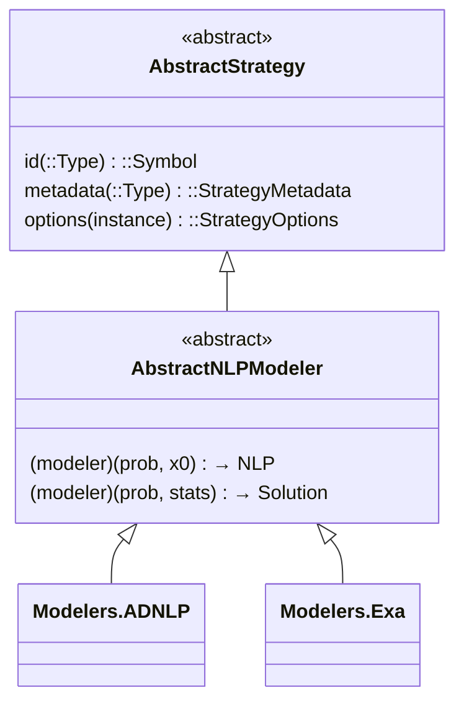

# Implementing a Modeler

```@meta
CurrentModule = CTSolvers
```

This guide explains how to implement an optimization modeler in CTSolvers. Modelers are strategies that convert `AbstractOptimizationProblem` instances into NLP backend models and convert NLP solver results back into problem-specific solutions. We use **Modelers.ADNLP** and **Modelers.Exa** as reference examples.

!!! tip "Prerequisites"
    Read [Architecture](@ref) first. A modeler is a strategy (see Implementing a Strategy in CTBase.jl documentation) with two additional **callable contracts**.

## The AbstractNLPModeler Contract

A modeler must satisfy **three contracts**:

1. **Strategy contract** — `id`, `metadata`, `options` (inherited from `AbstractStrategy`)
2. **Model building callable** — `(modeler)(prob, initial_guess) → NLP model`
3. **Solution building callable** — `(modeler)(prob, nlp_stats) → Solution`



Both callables have default implementations that throw `NotImplemented`.

```@example modeler
using CTSolvers
using CTBase: CTBase
nothing # hide
```

The `id` is available directly:

```@example modeler
CTBase.Strategies.id(CTSolvers.Modelers.ADNLP)
```

```@example modeler
CTBase.Strategies.id(CTSolvers.Modelers.Exa)
```

## Step-by-Step Implementation

We walk through the Modelers.ADNLP implementation as a reference.

### Step 1 — Define the struct

```julia
struct Modelers.ADNLP <: AbstractNLPModeler
    options::CTBase.Strategies.StrategyOptions
end
```

### Step 2 — Implement `id`

```@example modeler
CTBase.Strategies.id(CTSolvers.Modelers.ADNLP)
```

### Step 3 — Define defaults and metadata

The metadata defines all configurable options with types, defaults, and validators:

```@example modeler
CTBase.Strategies.metadata(CTSolvers.Modelers.ADNLP)
```

### Step 4 — Constructor and options accessor

The constructor validates options and stores them:

```@example modeler
modeler = CTSolvers.Modelers.ADNLP(backend = :optimized)
```

```@example modeler
CTBase.Strategies.options(modeler)
```

### Step 5 — Model building callable

This is the core of the modeler. It retrieves the appropriate **builder** from the problem and invokes it:

```julia
function (modeler::Modelers.ADNLP)(
    prob::AbstractOptimizationProblem,
    initial_guess,
)::ADNLPModels.ADNLPModel
    # Get the builder registered for this problem type
    builder = get_adnlp_model_builder(prob)

    # Extract modeler options as a Dict
    options = CTBase.Strategies.options_dict(modeler)

    # Build the NLP model, passing all options to the builder
    return builder(initial_guess; options...)
end
```

The key interaction is with the **Builder pattern**: the modeler doesn't know how to build the model itself — it asks the problem for a builder, then calls it. See [Implementing an Optimization Problem](@ref) for how builders work.

### Step 6 — Solution building callable

Same pattern, but for converting NLP results back into a problem-specific solution:

```julia
function (modeler::Modelers.ADNLP)(
    prob::AbstractOptimizationProblem,
    nlp_solution::SolverCore.AbstractExecutionStats,
)
    builder = get_adnlp_solution_builder(prob)
    return builder(nlp_solution)
end
```

## Modelers.Exa: A Second Example

Modelers.Exa follows the same pattern with different options and a slightly different callable signature:

```julia
struct Modelers.Exa <: AbstractNLPModeler
    options::CTBase.Strategies.StrategyOptions
end

CTBase.Strategies.id(::Type{<:Modelers.Exa}) = :exa

function CTBase.Strategies.metadata(::Type{<:Modelers.Exa})
    return CTBase.Strategies.StrategyMetadata(
        CTBase.Options.OptionDefinition(
            name = :base_type,
            type = DataType,
            default = Float64,
            description = "Base floating-point type used by ExaModels",
            validator = validate_exa_base_type,
        ),
        CTBase.Options.OptionDefinition(
            name = :backend,
            type = Union{Nothing, KernelAbstractions.Backend},
            default = nothing,
            description = "Execution backend for ExaModels (CPU, GPU, etc.)",
        ),
    )
end
```

The model building callable extracts `base_type` as a positional argument:

```julia
function (modeler::Modelers.Exa)(
    prob::AbstractOptimizationProblem,
    initial_guess,
)::ExaModels.ExaModel
    builder = get_exa_model_builder(prob)
    options = CTBase.Strategies.options_dict(modeler)

    # ExaModels requires BaseType as first positional argument
    BaseType = options[:base_type]
    delete!(options, :base_type)

    return builder(BaseType, initial_guess; options...)
end
```

!!! note "Different builder signatures"
    `ADNLPModelBuilder` takes `(initial_guess; kwargs...)` while `ExaModelBuilder` takes `(BaseType, initial_guess; kwargs...)`. Each modeler adapts the call to its builder's expected signature.

## Integration with build_model / build_solution

The `Optimization` module *owns* two generic functions, `build_model` and
`build_solution`. Their canonical `NotImplemented` contract stubs — the modeler
contract — live in the `Modelers` module, typed on `AbstractNLPModeler`; concrete
methods are provided by the package supplying the problem (e.g. CTDirect),
dispatched on the concrete `(problem, modeler)` pair. `build_model` returns an
`Optimization.BuiltModel` (the NLP plus an immutable build-time cache), and
`build_solution` dispatches on that bundle:

```julia
# In src/Modelers/contract.jl

function Optimization.build_model(
    prob::Optimization.AbstractOptimizationProblem, initial_guess, modeler::AbstractNLPModeler
)
    throw(Exceptions.NotImplemented(...))   # implemented per (problem, modeler) downstream
end

function Optimization.build_solution(
    built::Optimization.BuiltModel, model_solution, modeler::AbstractNLPModeler
)
    throw(Exceptions.NotImplemented(...))
end
```

These are used by the high-level `CommonSolve.solve`:

```mermaid
sequenceDiagram
    participant User
    participant Solve as CommonSolve.solve
    participant BuildModel as build_model
    participant Modeler as Modelers.ADNLP
    participant Problem as AbstractOptimizationProblem
    participant Builder as ADNLPModelBuilder

    User->>Solve: solve(problem, x0, modeler, solver)
    Solve->>BuildModel: build_model(problem, x0, modeler)
    BuildModel->>Modeler: modeler(problem, x0)
    Modeler->>Problem: get_adnlp_model_builder(problem)
    Problem-->>Modeler: ADNLPModelBuilder
    Modeler->>Builder: builder(x0; show_time, backend, ...)
    Builder-->>Modeler: ADNLPModel
    Modeler-->>Solve: ADNLPModel
```

## Validation

Verify the three contract methods explicitly:

```julia
# id is always available
CTBase.Strategies.id(Modelers.ADNLP)    # => :adnlp
CTBase.Strategies.id(Modelers.Exa)      # => :exa

# metadata is available without extension
CTBase.Strategies.metadata(Modelers.ADNLP) isa CTBase.Strategies.StrategyMetadata  # => true
CTBase.Strategies.metadata(Modelers.Exa)   isa CTBase.Strategies.StrategyMetadata  # => true

# options requires a constructed instance
modeler = Modelers.ADNLP()
CTBase.Strategies.options(modeler) isa CTBase.Strategies.StrategyOptions            # => true
```

For the callables, test with a fake or real problem:

```julia
# Create a fake problem with builders
prob = FakeOptimizationProblem(adnlp_builder, adnlp_solution_builder)

# Test model building
modeler = Modelers.ADNLP(backend = :optimized)
nlp = modeler(prob, x0)
@test nlp isa ADNLPModels.ADNLPModel

# Test solution building
stats = solve(nlp, solver)
solution = modeler(prob, stats)
@test solution isa ExpectedSolutionType
```

## Summary: Adding a New Modeler

To add a new modeler (e.g., `MyModeler` for a new NLP backend):

1. Define `MyModeler <: AbstractNLPModeler` with `options::CTBase.Strategies.StrategyOptions`
2. Implement `CTBase.Strategies.id(::Type{<:MyModeler}) = :my_backend`
3. Implement `CTBase.Strategies.metadata(::Type{<:MyModeler})` with option definitions
4. Write constructor: `MyModeler(; mode, kwargs...)`
5. Implement `CTBase.Strategies.options(m::MyModeler) = m.options`
6. Implement model building callable: `(modeler::MyModeler)(prob, x0) → NLP`
7. Implement solution building callable: `(modeler::MyModeler)(prob, stats) → Solution`
8. Add corresponding builder types in `Optimization` if needed (`MyModelBuilder`, `MySolutionBuilder`)
9. Add contract methods in `Optimization`: `get_my_model_builder`, `get_my_solution_builder`
