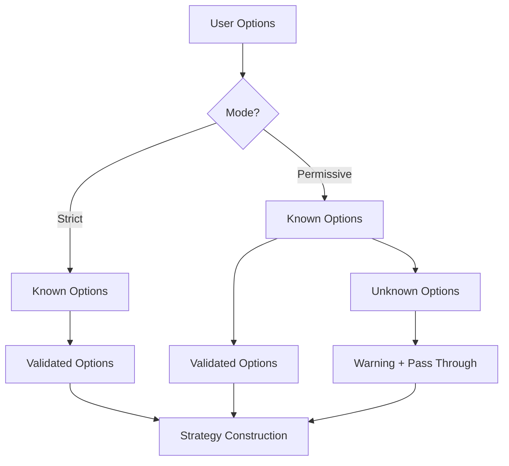

# Options Validation: Strict vs Permissive Modes

CTSolvers provides a flexible option validation system with two modes to balance safety and flexibility for different user needs.

## 🎯 Quick Start

```julia
using CTSolvers
using CTSolvers.Solvers

# Default: Strict mode (safe)
solver = Solvers.IpoptSolver(max_iter=1000)  # ✅ Known option
# solver = Solvers.IpoptSolver(unknown=123)  # ❌ Error: unknown option

# Permissive mode (flexible)
solver = Solvers.IpoptSolver(
    max_iter=1000, 
    custom_backend_option="advanced";  # ✅ Accepted with warning
    mode=:permissive
)
```

---

## 📚 Table of Contents

1. [Understanding the Modes](#understanding-the-modes)
2. [When to Use Each Mode](#when-to-use-each-mode)
3. [Option Disambiguation](#option-disambiguation)
4. [Practical Examples](#practical-examples)
5. [Migration Guide](#migration-guide)
6. [Troubleshooting](#troubleshooting)
7. [FAQ](#faq)

---

## 🧠 Understanding the Modes

### Mode Strict (Default)

**Purpose**: Maximum safety and error prevention  
**Behavior**: Rejects any option not defined in strategy metadata

```julia
# ✅ Known option - works
solver = Solvers.IpoptSolver(max_iter=1000)

# ❌ Unknown option - throws error
solver = Solvers.IpoptSolver(unknown_option=123)
# ERROR: Unknown options provided for IpoptSolver
#        Unrecognized options: [:unknown_option]
#        Available options: [:max_iter, :tol, :print_level, ...]
```

**Use when**:
- You're learning CTSolvers
- You want maximum safety
- You're developing/debugging
- You want early error detection

### Mode Permissive

**Purpose**: Flexibility for advanced users and backend-specific options  
**Behavior**: Accepts unknown options with warning, passes them directly to backend

```julia
# ✅ Known option - works normally
solver = Solvers.IpoptSolver(max_iter=1000; mode=:permissive)

# ⚠️ Unknown option - accepted with warning
solver = Solvers.IpoptSolver(
    custom_option="advanced"; 
    mode=:permissive
)
# WARNING: Unrecognized options passed to backend
#         Unvalidated options: [:custom_option]
#         These options will be passed directly to the IpoptSolver backend
```

**Use when**:
- You need backend-specific options
- You're an advanced user
- You're using experimental features
- You need options not yet defined in CTSolvers

---

## 🎯 When to Use Each Mode

### ✅ Use Strict Mode When

| Situation | Reason | Example |
|-----------|--------|---------|
| **Learning CTSolvers** | Get helpful error messages | `IpoptSolver(max_iter=1000)` |
| **Development** | Catch typos early | `IpoptSolver(max_iter=1000)` |
| **Production code** | Maximum safety | `IpoptSolver(max_iter=1000)` |
| **Teaching** | Clear feedback | `IpoptSolver(max_iter=1000)` |

### 🔓 Use Permissive Mode When

| Situation | Reason | Example |
|-----------|--------|---------|
| **Backend-specific options** | Access advanced features | `IpoptSolver(custom_ipopt_option=...; mode=:permissive)` |
| **Experimental features** | Try new options | `IpoptSolver(beta_option=...; mode=:permissive)` |
| **Legacy code** | Migrate gradually | `IpoptSolver(old_option=...; mode=:permissive)` |
| **Power users** | You know what you're doing | `IpoptSolver(advanced=...; mode=:permissive)` |

---

## 🔀 Option Disambiguation

When the same option name exists in multiple strategies (e.g., both solver and modeler have `max_iter`), you must disambiguate:

### The Problem

```julia
# ❌ Ambiguous - which strategy gets max_iter?
solve(ocp, method; max_iter=1000)  # Solver? Modeler? Both?
```

### The Solution: `route_to()`

```julia
using CTSolvers.Strategies

# ✅ Clear routing
solve(ocp, method; 
    max_iter = route_to(solver=1000)        # Only solver gets 1000
)

# ✅ Different values for different strategies
solve(ocp, method; 
    max_iter = route_to(solver=1000, modeler=500)
    # Solver: 1000 iterations
    # Modeler: 500 iterations
)
```

### Syntax Reference

```julia
# Single strategy
route_to(strategy=value)

# Multiple strategies
route_to(strategy1=value1, strategy2=value2, ...)

# Examples
route_to(solver=1000)                    # One strategy
route_to(solver=1000, modeler=500)        # Two strategies
route_to(solver=1000, modeler=500, discretizer=100)  # Three strategies
```

---

## 📊 System Architecture

### Validation Flow



### Option Routing Flow

```mermaid
graph TD
    A[User Options] --> B[Extract Action Options]
    B --> C[Remaining Strategy Options]
    C --> D{Disambiguated?}
    D -->|Yes| E[route_to() → RoutedOption]
    D -->|No| F[Auto-route]
    E --> G[Extract Strategy IDs]
    F --> H[Check Ownership]
    G --> H
    H -->|Known| I[Route to Strategy]
    H -->|Unknown + Permissive| J[Warning + Route]
    H -->|Unknown + Strict| K[Error]
```

---

## 💡 Practical Examples

### Example 1: Basic Usage

```julia
using CTSolvers
using CTSolvers.Solvers

# Strict mode (default)
solver = Solvers.IpoptSolver(
    max_iter=1000,           # ✅ Known option
    tol=1e-6                # ✅ Known option
)

# Permissive mode for advanced options
solver = Solvers.IpoptSolver(
    max_iter=1000,           # ✅ Known option
    custom_linear_solver="ma57",  # ⚠️ Unknown but accepted
    mu_strategy="adaptive",       # ⚠️ Unknown but accepted
    mode=:permissive
)
```

### Example 2: Disambiguation in solve()

```julia
using CTSolvers
using CTSolvers.Strategies

# Method with multiple strategies
method = (:collocation, :adnlp, :ipopt)

# Problem with ambiguous option
# solve(ocp, method; max_iter=1000)  # ❌ Which strategy?

# Solution with disambiguation
solve(ocp, method; 
    max_iter = route_to(solver=1000)        # Solver gets 1000
)

# Different values for different strategies
solve(ocp, method; 
    max_iter = route_to(
        solver=1000,    # Solver: 1000 iterations
        modeler=500     # Modeler: 500 iterations
    )
)
```

### Example 3: Mixed Known/Unknown Options

```julia
using CTSolvers
using CTSolvers.Solvers

# Known options always validated
solver = Solvers.IpoptSolver(
    max_iter=1000,        # ✅ Validated (type check)
    tol=1e-6,            # ✅ Validated (custom validator)
    custom_option="test", # ⚠️ Unknown, accepted with warning
    mode=:permissive
)

# Type validation still applies to known options
solver = Solvers.IpoptSolver(
    max_iter="invalid",   # ❌ Type error, even in permissive mode
    mode=:permissive
)
```

### Example 4: Error Messages and Suggestions

```julia
# Strict mode provides helpful suggestions
try
    Solvers.IpoptSolver(max_itter=1000)  # Typo
catch e
    println(e)
end
# ERROR: Unknown options provided for IpoptSolver
#        Unrecognized options: [:max_itter]
#        Available options: [:max_iter, :tol, :print_level, ...]
#        Suggestions for :max_itter:
#          - :max_iter (Levenshtein distance: 2)
#        If you are certain these options exist for the backend,
#        use permissive mode:
#          IpoptSolver(...; mode=:permissive)
```

---

## 🔄 Migration Guide

### From Default Behavior

**No changes needed!** The default strict mode provides the same safety as before.

### From Manual Tuple Syntax

**Old syntax** (still works for backward compatibility):
```julia
max_iter = (1000, :solver)
max_iter = ((1000, :solver), (500, :modeler))
```

**New syntax** (recommended):
```julia
max_iter = route_to(solver=1000)
max_iter = route_to(solver=1000, modeler=500)
```

### Adding Permissive Mode

**Step 1**: Identify where you need flexibility
```julia
# Before
solver = Solvers.IpoptSolver(advanced_option="value")  # Error!

# After
solver = Solvers.IpoptSolver(
    advanced_option="value"; 
    mode=:permissive
)  # Works with warning
```

**Step 2**: Gradually clean up
```julia
# Define the option in metadata when ready
# Then remove mode=:permissive
solver = Solvers.IpoptSolver(advanced_option="value")  # Now works in strict mode
```

---

## 🛠️ Troubleshooting

### Common Issues

#### Issue: "Unknown option" error in strict mode

```julia
# Problem
solver = Solvers.IpoptSolver(unknown_option=123)
# ERROR: Unknown options provided for IpoptSolver

# Solutions:
# 1. Fix typo
solver = Solvers.IpoptSolver(max_iter=123)  # Correct name

# 2. Use permissive mode if option is valid but unknown
solver = Solvers.IpoptSolver(unknown_option=123; mode=:permissive)

# 3. Define option in metadata (advanced)
```

#### Issue: "Ambiguous option" error

```julia
# Problem
solve(ocp, method; max_iter=1000)
# ERROR: Option :max_iter is ambiguous between strategies

# Solution: Use route_to()
solve(ocp, method; 
    max_iter = route_to(solver=1000)  # Clear routing
)
```

#### Issue: Warning spam in permissive mode

```julia
# Problem: Too many warnings for known unknown options

# Solution 1: Define options in metadata
# Add option definitions to strategy metadata

# Solution 2: Suppress specific warnings
# (Advanced) Use Julia's warning system
```

### Debug Mode

```julia
# Enable verbose warnings to understand what's happening
using CTSolvers
ENV["JULIA_DEBUG"] = "CTSolvers"

solver = Solvers.IpoptSolver(unknown=123; mode=:permissive)
# More detailed warning information
```

---

## ❓ FAQ

### Q: When should I use permissive mode?

**A**: Use permissive mode when:
- You need backend-specific options not yet defined in CTSolvers
- You're experimenting with new features
- You're migrating legacy code
- You're an advanced user who knows the options are valid

### Q: Does permissive mode affect performance?

**A**: Minimal impact. Known options are always validated. Unknown options bypass validation but this is fast. The main overhead is warning generation.

### Q: Can I mix strict and permissive modes?

**A**: Yes! Mode is specified per strategy construction:
```julia
solver1 = Solvers.IpoptSolver(max_iter=1000)  # Strict
solver2 = Solvers.IpoptSolver(custom=123; mode=:permissive)  # Permissive
```

### Q: What happens to unknown options in permissive mode?

**A**: They are passed directly to the backend without validation. The backend will handle them (or reject them if invalid).

### Q: How do I know which options are available?

**A**: Use the error message in strict mode, or check strategy metadata:
```julia
using CTSolvers.Strategies
option_names(Solvers.IpoptSolver)  # List all known options
```

### Q: Can I define my own options?

**A**: Yes! Options are defined in strategy metadata. This is an advanced topic - see the developer documentation.

### Q: Is route_to() required for all options?

**A: No! Only for options that exist in multiple strategies. Most options are automatically routed.

---

## 📚 Further Reading

- [Strategy Options API](@ref)
- [Option Disambiguation](@ref)
- [Strategy Metadata](@ref)
- [Developer Guide: Defining Options](@ref)

---

## 🎉 Summary

CTSolvers' validation system provides:

- ✅ **Safety by default** (strict mode)
- 🔓 **Flexibility when needed** (permissive mode)
- 🎯 **Clear disambiguation** (`route_to()`)
- 📚 **Helpful error messages**
- 🔄 **Backward compatibility**

Start with strict mode for safety, switch to permissive mode when you need advanced features!
